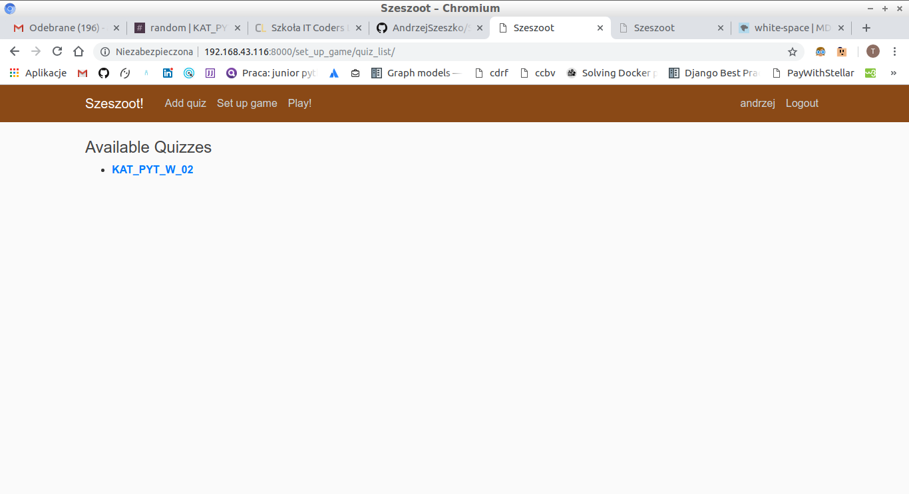
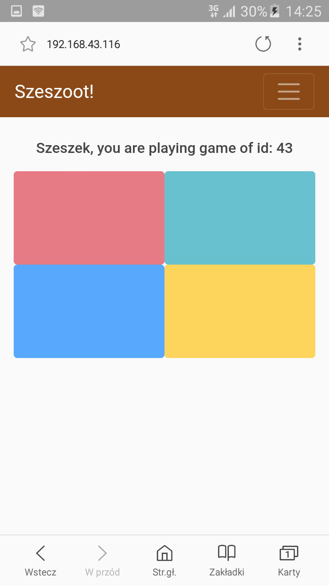
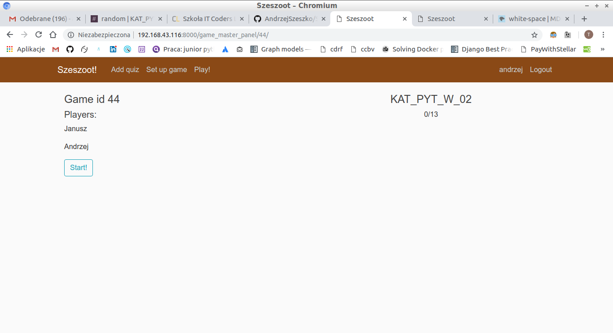
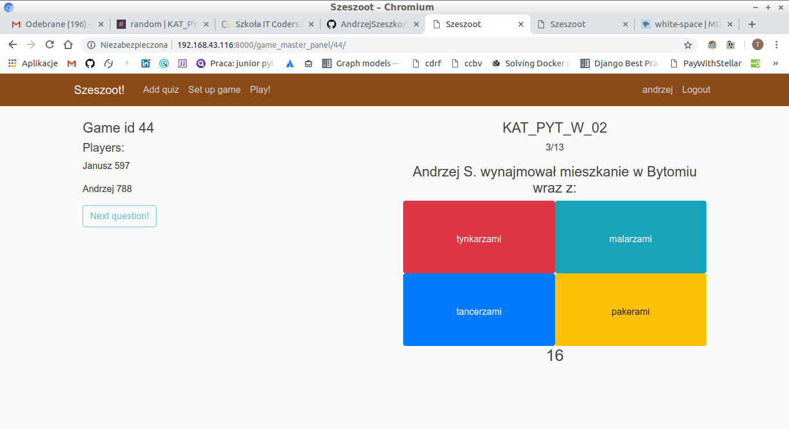
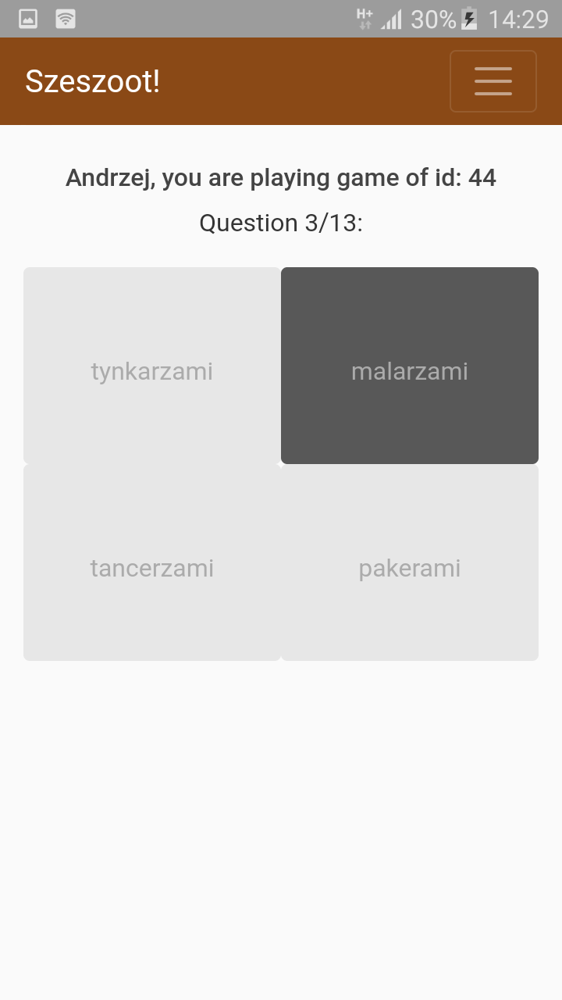
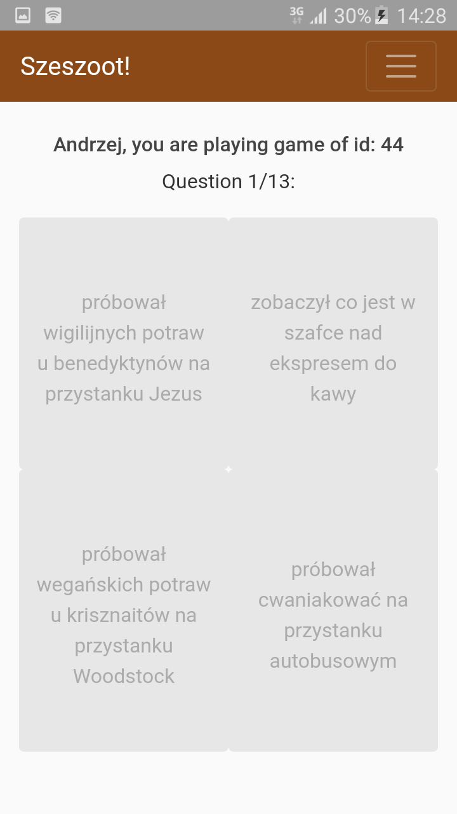
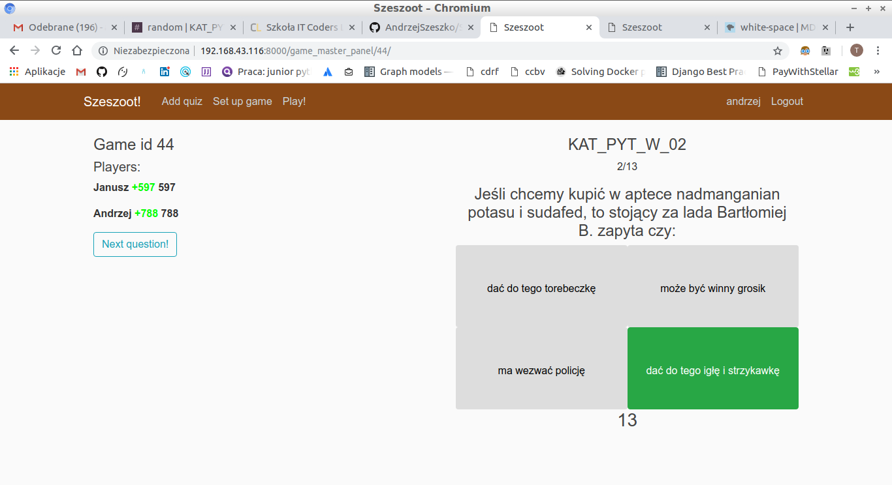
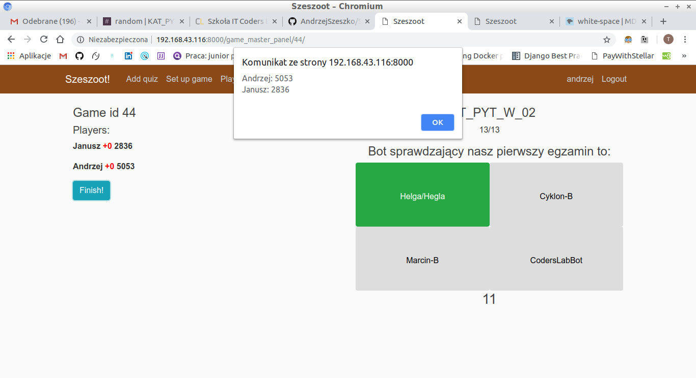
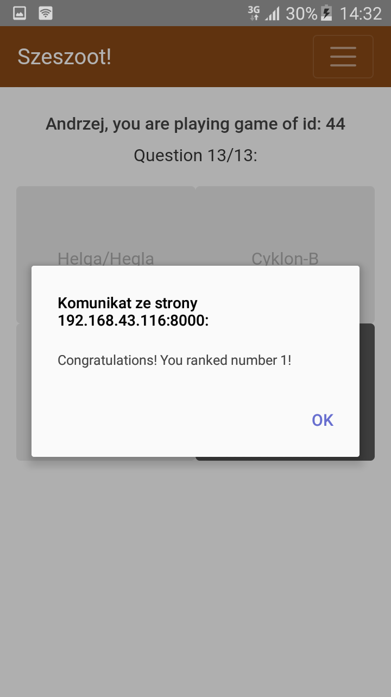

# Szeszoot
This is Kahoot-like app made by myself. (in development)

Usage:
1) As a Game Master click "Set up game" (you must be logged in)
2) Then choose one of available quizzes
3) On the Game Master Panel that appears, there is game id. Share it with players you want to join the game.
4) Wait for the players to join (their nicknames will appear on the Game Master Panel)
5) As a Player, click "Play!" (you don't have to be logged in)
6) Then type your nickname of choice and game id you want to join
7) Click "Join"
8) As a Game Master click "Start!" once all players have joined the game
9) Click "Next Question!" when you want to push next question to Players
10) Rest of steps is quite intuitive :)

HAVE FUN!

Screens:

Choosing Quiz

Joining the game

Waiting for firs question

All players are ready

First question

Player has answered

Time to answer

Player hasn't answered

Players has answered

Results!

Congratulations!

