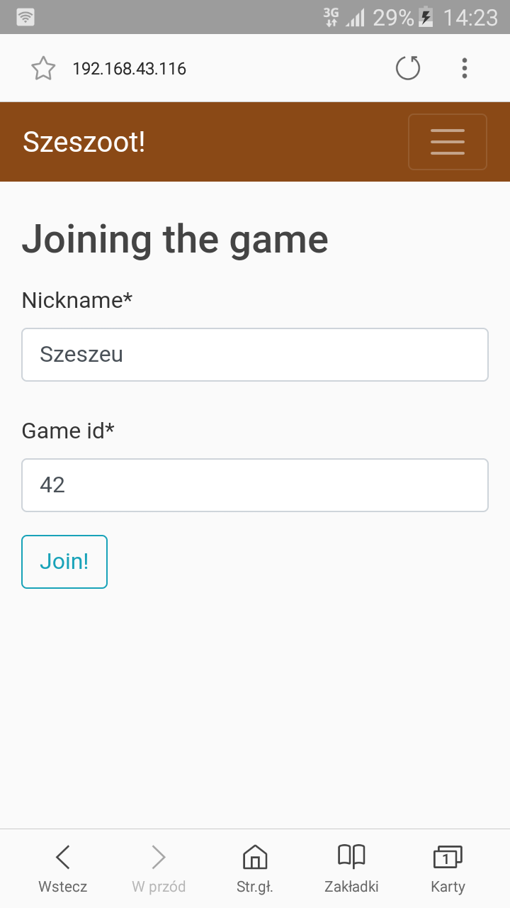
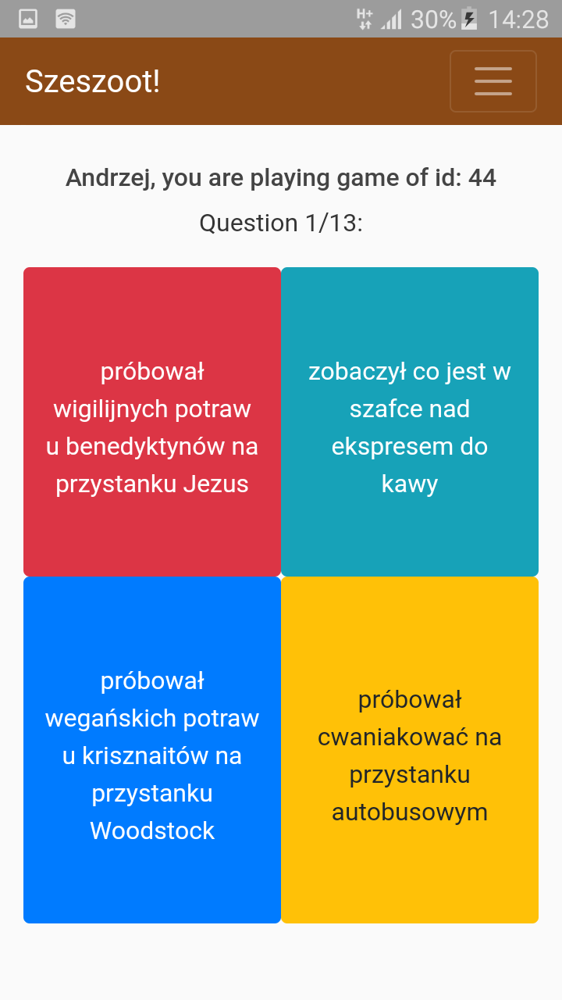

# Szeszoot
This is Kahoot-like app made by myself. (in development)

<a href="http://139.162.187.56/">Link to deployed version</a>

## Usage:
1) As a Game Master click "Set up game" (you must be logged in)
2) Then choose one of available quizzes
3) On the Game Master Panel that appears, there is game id. Share it with players you want to join the game.
4) Wait for the players to join (their nicknames will appear on the Game Master Panel)
5) As a Player, click "Play!" (you don't have to be logged in)
6) Then type your nickname of choice and game id you want to join
7) Click "Join"
8) As a Game Master click "Start!" once all players have joined the game
9) Click "Next Question!" when you want to push next question to Players
10) Rest of steps is quite intuitive :)

HAVE FUN!

## Screens:

Choosing Quiz 

Joining the game 

Waiting for firs question 

All players are ready 

First question 

Player has answered 

Time to answer 

Player hasn't answered 

Players has answered 

Results! 

Congratulations! 

## To do:
- SSL cerificate
- domain name
- fix Safari issues
- fix adding quiz description
- editing and deleting account
- password resetting via email
- improve ending pop-up (via bootstrap modals)
- editing and deleting quizzes
- access control to some quizzes
- add valid-answer-is-the-one-which-was-answered-most-frequently mode
